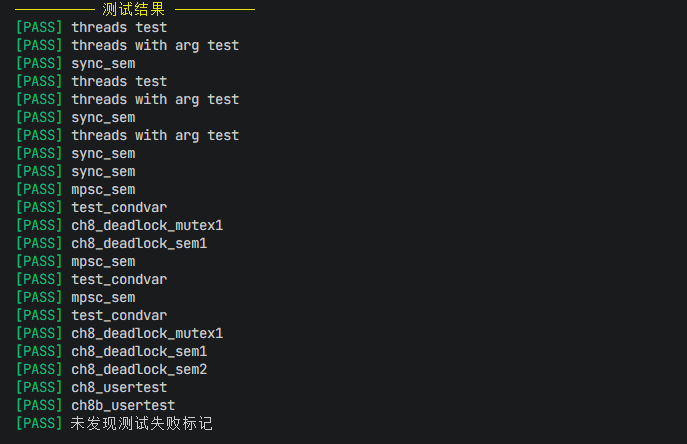
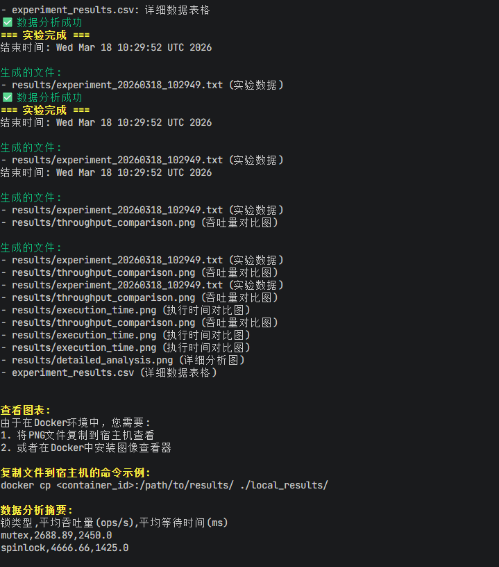

# 进度汇报T2L4------同步互斥机制（从“能跑”到“公平/可证明不饿死”）

## 第一周：

阶段一finished：完成了ch1-8

阶段二完成了部分测试，相关思路在下面的第二周中

## 第二周：

**1.**既然以ch8为参照的话，就需要排除其他的干扰因素加快测试速度和质量，只关心**我需要的**同步等机制的测试效果，只保留了

ch8_deadlock_mutex1.rs  ch8_deadlock_sem2.rs  ch8b_usertest.rs  sync_sem.rs      threads.rs
ch8_deadlock_sem1.rs    ch8_usertest.rs       mpsc_sem.rs       test_condvar.rs  threads_arg.rs

**2.**通过**AI**来总结项目重点，我只负责审查后让其设计相对应的数据结构和方向：

 **这个实验的重点是：让“锁不仅能用”，而是“行为可测、性能可比、公平性可验证”。**

再展开成三点最核心的：

1. **正确性**
   - 保证互斥、不死锁、不丢唤醒（不是“跑起来就行”）
2. **性能对比**
   - 看清自旋锁 vs 睡眠锁在竞争、CPU占用、上下文切换上的差异
3. **公平性（最关键）**
   - 是否会出现 starvation
   - 最大等待时间是否可控（能不能“证明不会饿死”）

 最本质一句话：
 **从“实现锁”升级为“理解并验证并发系统的行为”。**

但是仅仅只是上述要求AI只能实现如SpinLock数据结构的设计，量化分析的代码无法实现，需要深入理解实验的要求：
**把仅仅是实现了同步机制锁变成带统计的锁 + 可控压力测试 + 自动化出结果并且统计分析数据一条龙的落地项目**

然后让AI具体化主旨为具体的结构设计方向：
**具体做法是：先在每种锁内部埋点统计（记录加锁尝试、等待时间、持锁时间、sleep/wakeup 等），再写一个统一的多线程压力测试程序（循环加锁→执行临界区→解锁，控制线程数和临界区时间），分别运行不同锁并收集数据，最后用表格对比这些指标，从而分析它们在性能、上下文切换和公平性上的差异。**

总体设计后需要量化的表格或者图形化的表示，docker中图形化不好搞，我就先用Python+csv表格吧(记得**安装python的环境**，不然会失败滴)

暂时的效果展示，我会在周四晚或者是周五更新更加详细的说明文档

## 接下来需要克服的难题：

1.话的图中出现"口"形式的错误乱码

2.使用数据来对比优化后的提升效果
